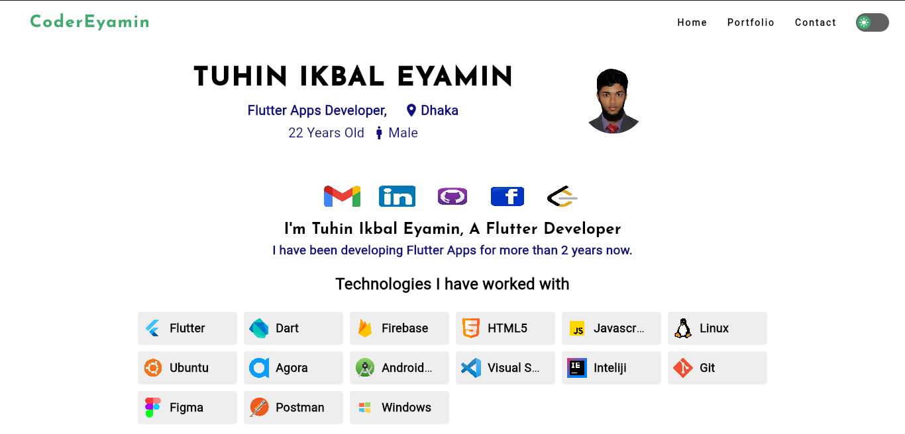
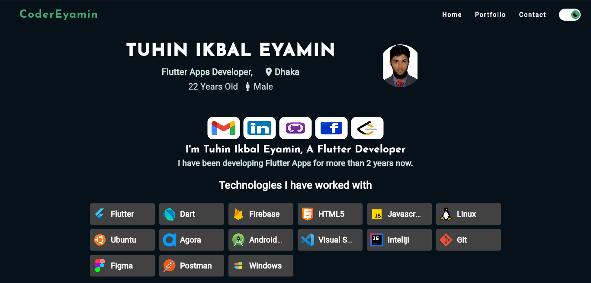
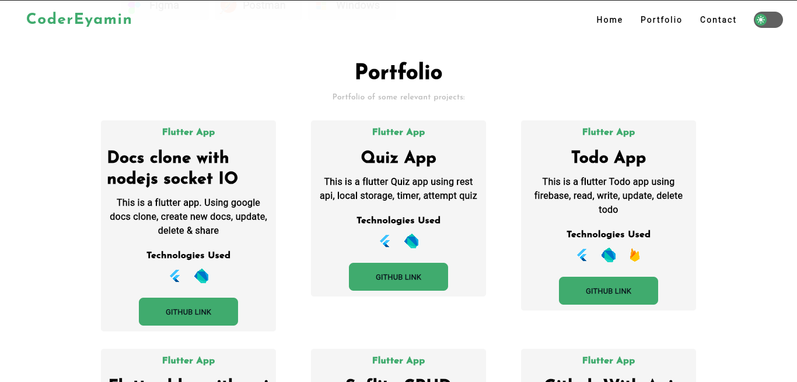
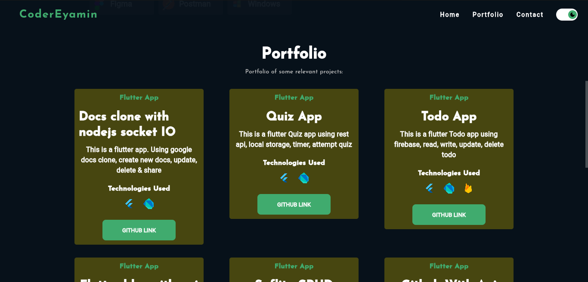
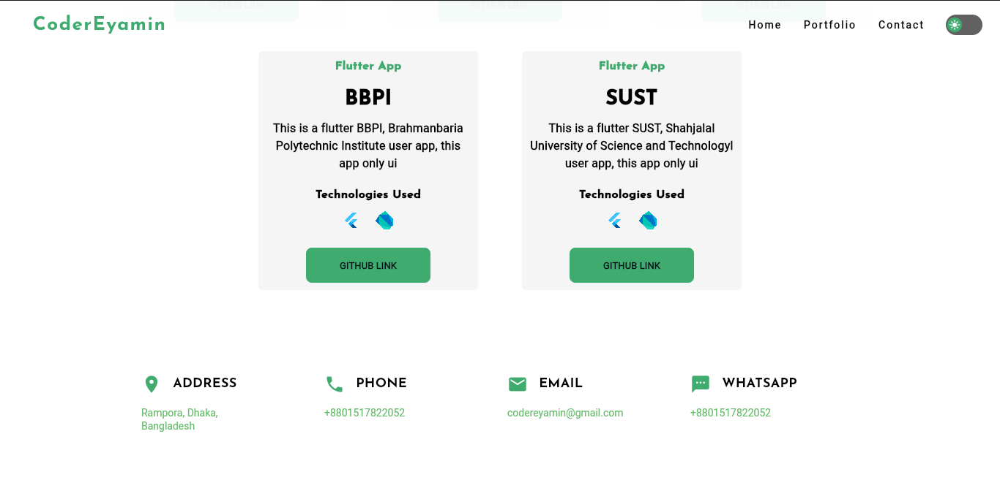
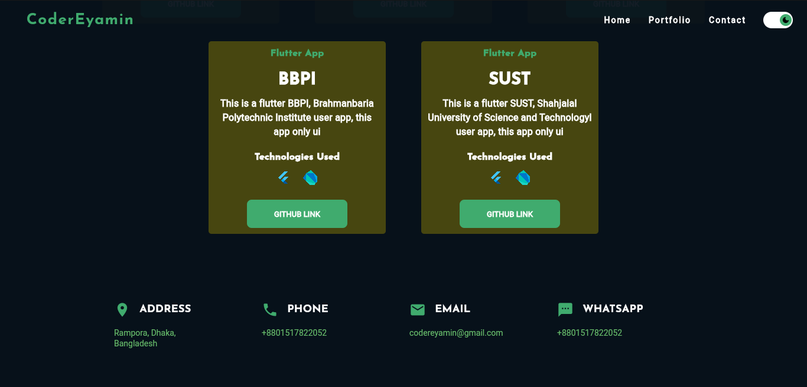

# my_portfolio

Visit the website from here https://codereyamin.com/

   
  
  
  
  
  
  
  

### State Management
- RiverPod

### Features
- Multiple themes
- Responsive Design (Mobile, Tablet, Desktop)
- Animations.

### Dependencies
- animated_theme_switcher:
- google_fonts:
- flutter_riverpod:
- responsive_framework:
- url_launcher:
